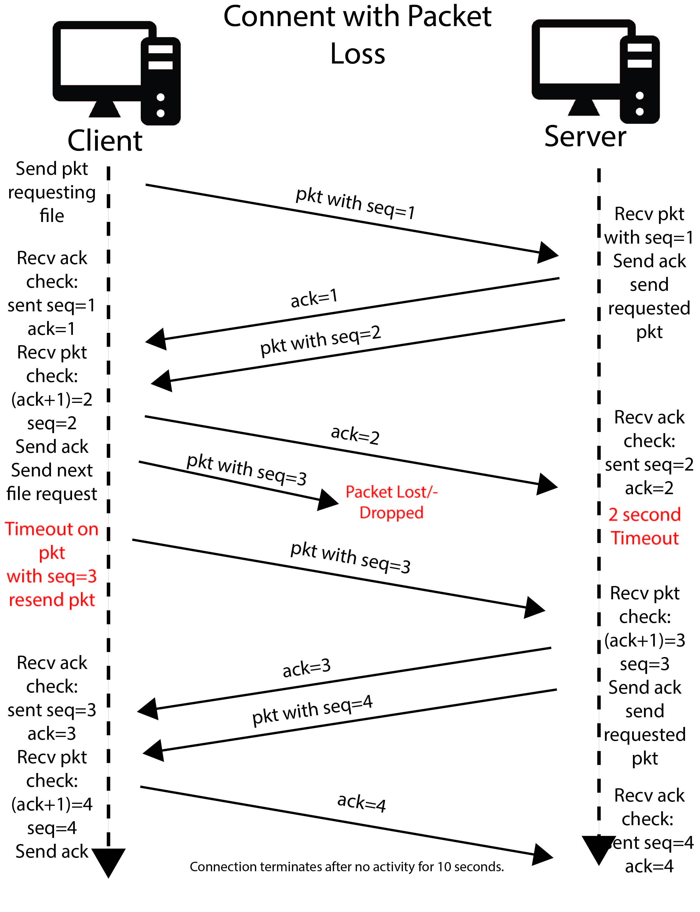

# **Reliable File Transfer**

### **Description:**

A reliable file transfer protocol holds the responsibility of implementing service abstraction. However, 
the difficulty level of this protocol lies in the fact that the layer below the sending and receiving 
process may be unreliable. When the sending and receiving process is not channeled through a reliable 
channel, packets may be lost in transit without being recognized. On the other hand, when the sending 
and receiving process is channeled through a reliable channel, the packets can be sent and received
without confusion or difficulty. Our goal is to create a UDP protocol that ensures reliable file transfer. 
UDP is a simple protocol that guarantees data integrity but not packet delivery; therefore, a reliable file
transfer protocol must be added on top of an already working UDP protocol thereby allowing UDP to 
facilitate reliability. More specifically, our reliable file transfer protocol will be able to overcome
lost packets, as well as out-of-sequence packets.

On the client-side of the program, we will implement a reliable file transfer protocol that takes in
four command-line arguments: SERVER_IP, SERVER_PORT, REMOTE_PATH, and LOCAL_PATH, where: SERVER_IP is
the IP address of the server, SERVER_PORT is the port number that the server is listening, REMOTE_PATH 
is the filesystem path on the server where files are to be downloaded, and LOCAL_PATH is the filesystem 
path on the client-side where downloaded files are stored. Our reliable file transfer protocol will also
have a system in place where: once a UDP packet has requested a file located on the server, the corresponding 
UDP packet will be sent to the server-side. However, if there is no response--an acknowledgment of some 
sort-- we will wait for two seconds and retry the sending process. This retry sending process will be done
up to eight times before the sending system will error out. The client-side of the program will also be
able to receive and store file data to LOCAL_PATH.

On the server-side of the program, we will be implementing a reliable file transfer protocol very 
similar to the client-side; however, only one argument is taken in--LISTENING_PORT. LISTENING_PORT 
refers to the network port number where the server is listening. On the server-side, we are to implement 
a service where the server listens for client connection at the UDP socket and can send readable files 
to the client.

Both the client-side and server-side of the program must follow standard C library systems, and be 
compiled and run on Linux.

### **Build:**

There are two C programs to run in order to use this reliable file transfer protocol. First, you need to compile the server program. You will do this by running this command at the command line:
	gcc -g -Wall -o server server.c
Then you will complile the client program. You will run this command at the command line:
	gcc -g -Wall -o client client.c
Finally, after building these programs, you can run them from different terminals with:
     ./server { Listening Port }
     ./client { Server IP } { Server Port } { Remote Path } { Local Path }

First, run the server, and assuming no errors, you can then run the client. It will ask for a file name, but assuming the file exists,
they will automatically connect and communicate.

### **Specification:**

##### **Operation with a Perfect Working Connection**

An ideal operation with a working connection with no loss or bit errors is as follows.

1. The client requests a file from the server using the network port number the server is listening. 

2. The client creates and sends a UDP packet requesting a file located on the 
   server using the filesystem path where the file can be downloaded. 
   
    - If no response, the client will wait two seconds, then resend request. 
    - If no response still, the client will repeat the step above eight times before assuming the connection 
      was loss and terminating the connection.
    
3. Connected to the client's UDP packet described in step 2 is a sequence number, which plays an important role 
if a packet is lost.
  
4. The server receives file request made by the client by listening on the network port. 

    - If the requested file does not exist, an error message wll be sent to the client and the connection will be terminated. 

5. The server then puts the sequence number attached to the received packet into an acknowledgment message that is sent back to the client. 

6. The server also sends the requested file in a packet with a sequence number equal to the received sequence number plus 1.
   
7. The client upon receiving the acknowledgment from the server, then checks to see if the previous packet sequence number is 
   equal to the acknowledgment message. 
   
    - If the previous packet sequence number is equal to the acknowledgment message, the next packet is sent. 
    - If the previous packet sequence number is not equal to the acknowledgement message, the packet is dropped. 
    
8. The client then puts the sequence number attached to the received packet into an acknowledgment message that is sent back to the server.

9. The client also sends the next file request with a sequence number equal to the received sequence number plus 1.  

10. The process above repeats until either the client or the server terminates the connection.

##### **Operation when a Connection Experiences Packet Loss**

In an ideal operation a connection would experience no packet loss or bit errors; however, 
that operation is not guaranteed therefore measures are set in place to overcome packet loss. 
In our operation we make use of a two second timer that when "timed out" will trigger 
the client to resend the previous packet. If no response occurs happens more than eight times 
the client will assume the connection has been lost and the connection will be terminated. 
If a server acknowledgment is lost, the timer will effectively have the client request the previous 
packet again to receive a new acknowledgement. 

##### **Operation when a Connection Experiences Order Delivery Issues**

In the case where a connection experiences loss of either a packet or an acknowledgment or experiences 
delay, duplicate packet requests may be an issue as well as other order delivery issues. 
In our operation we make use of sequence numbers in tandem with acknowledgements to provide 
a secure reliable file transfer connection. In the case where a packet request 
made by the client is delayed and the client requests the packet again only to have both 
packet requests arrive at the server, the server will acknowledge both packets. It is both the client's job and the server's job
to check each acknowledgment message against the previous packet sequence number. If the sequence number is the 
same as the acknowledgment message the next packet will be sent. If the previous packet sequence number 
is different than the acknowledgment message the packet will be dropped, then the client will wait 
two seconds for another acknowledgment. If no acknowledgement is received after two seconds, the 
packet will be resent. If another acknowledgment is received within the two second window, the acknowledgement 
message will be checked against the previous sequence number, and the cycle continues. 

### **Test:**
Testing Setup:
1. Using vmware we created two clones of the eagle virtual machine to run our client and server, and one clone of hummingbird to act as a router between the client and server.
2. We connected client and server to separate switches, and connected our router to both switches.
3. We boosted our client, server, and router logging in as root.
4. We set up client’s and server’s ip addresses following IPv4 addresses.
5. We added default getaways for both client and server using % ip route add default via {gateway} dev {interface}
6. Now client and server can communicate through a router.

Testing Procedure:
1. We started Wireshark to capture packets relevant to the testing procedure and filtered the results with udp.port == 8080.
2. In the command line, we typed % gcc -g -Wall -o server server.c to start server. 
3. Then in the command line, we typed % gcc -g -Wall -o client client.c to compile the client program.
4. After building the programs, we ran them from different terminals:
      - ./server { Listening Port } 
      - ./client { Server IP } { Server Port } { Remote Path } { Local Path }
5. First, run the server, and assuming no errors, you can then run the client. It will ask for a file name, but assuming the file exists,
   they will automatically connect and communicate.
6. We then stopped Wireshark to view the captured packets.

Testing Procedure to Simulate Packet Delay/Loss/Disorder:
1. To view the traffic control settings for the “queuing disciple,” we used % tc qdisc show.
2. Stimulating Packet Delay/Loss/Disorder
    - To add delay to the router, we used % tc qdisc add dev {interface} root netem delay 100ms.
    - To add packet loss to the router, we used % tc qdisc add dev {192.168.1.1 interface} root netem loss 50.
    - To add disorder to the router, we used % tc qdisc add dev ens33 root netem delay 100ms reorder 30%.
3. Then we ran the testing procedure.
4. When viewing the captured packets in Wireshark we can see if the RFT works, or use the diff command in the command line to check if the sent packet is the same in both locations. 

Results:
   - Screenshots of the print statements while packets and acknowledgments are being sent.

 
     
   - Screenshot of the diff command line command returning nothing, thereby demonstrating no differences among the sent file and the received file. 

     
   - Screenshots of both files: the sent file, and the received file.

     
     
